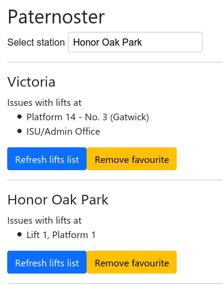

# Paternoster

Paternoster is a tool for helping you determine when the train station you're going to doesn't have working lifts, and is named after the [continually moving lift type](https://en.wikipedia.org/wiki/Paternoster_lift).

It uses data from the [Tfl Unified API](https://api.tfl.gov.uk/) and the [NWR Lifts and Escalators dataset](https://raildata.org.uk/dashboard/dataProduct/P-acf7efb5-77bd-47ed-be3c-05e4f3d7d6a7/overview), and so has data for lifts in both London and the wider UK.

There is a live instance at https://paternoster.tevp.net/

## Local installation

1. `pip install -r requirements.txt`
2. `make debug`
3. Goto http://localhost:5000/

## Acknowledgements

Thanks to obviously [TfL](https://tfl.gov.uk/) and [National Rail](https://www.nationalrail.co.uk/) for providing the APIs, as well as the [Open Rail Data Wiki](https://wiki.openraildata.com/) for docs on those and [Up Down London](https://www.updownlondon.com/) for further hints on use of them.
